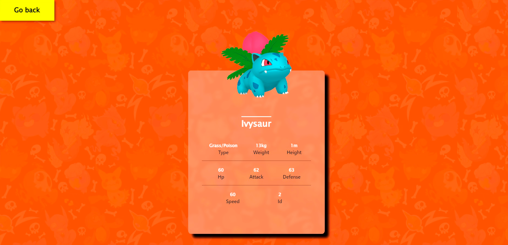

# Individual Project - Henry Pokemon

<h1>Deploy:
<a href='http://pokemon289.herokuapp.com'>http://pokemon289.herokuapp.com</a>
</h1>

## Objetivos del Proyecto

- Construir una App utlizando React, Redux, Node y Sequelize.
- Afirmar y conectar los conceptos aprendidos en la carrera.
- Aprender mejores prácticas.
- Aprender y practicar el workflow de GIT.
- Usar y practicar testing.

## Resumen

El proyecto consta de una pagina principal desde donde podremos visualizar una lista de Pokemons paginados traidos tanto desde la api externa "PokeApi" como de la base de datos utilizando Node, Sequelize y Express.

Esta misma pagina cuenta con filtros combinados y una barra de busqueda que nos permitiran encontrar facilmente el pokemon que estamos buscando y acceder asi a su pagina detalle donde se muestran toda su informacion.

Si no encontraste lo que buscabas tambien contras con una pagina de creacion, donde rellenando un formulario podes crear tu propio pokemon y verlo mas tarde en la pagina de inicio o detalle.

## Tecnologias y recursos
- __JavaScript__
- __React__
- __Redux__
- __Css__
- __Node__
- __Express__
- __Postgres__
- __Sequelize__
- __PokeApi__

## Para levantar la pagina de forma local
1. Dentro de la carpeta api, crear un archivo .env con el siguiente formato:
__DB_USER = "YOUR_POSTGRES_USER"__
__DB_PASSWORD = "YOUR_POSTGRES_PASS"__
__DB_HOST = "localhost"__
2. Deberas crear tambien una base de datos usando postgres llamada "pokemon".
2. Abrir una consola en la carpeta api y escribir los comandos "npm i" seguido de "npm start".
3. Abrir una consola en la carpeta client y escribir "npm i" seguido de "npm start".

#

#

#

#

#

#

